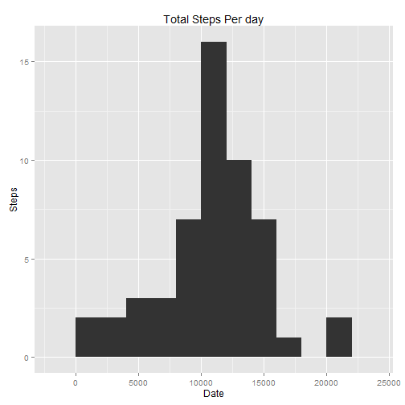

This is an R Markdown document. Markdown is a simple formatting syntax for authoring HTML, PDF, and MS Word documents. For more details on using R Markdown see <http://rmarkdown.rstudio.com>.

When you click the **Knit** button a document will be generated that includes both content as well as the output of any embedded R code chunks within the document. You can embed an R code chunk like this:

#### A. Loading and preprocessing data

*Assuming data is Unzipped

```r
Activity<-read.csv("activity.csv")
```
#### B. What is mean total number of steps taken per day?
1. Calculate the total number of steps taken per day
2. Make a histogram of the total number of steps taken each day

```r
library(ggplot2)
totalstepsdata <- aggregate(steps~date, data=Activity,FUN=sum )
g<- ggplot(totalstepsdata, aes( steps))
g<-g+ geom_histogram(binwidth=2000)+ xlab("Date")+ ylab("Steps") + ggtitle("Total Steps Per day")

print(g)
```

 

3. Calculate and report the mean and median of the total number of steps taken per day

* _The Mean is_

```r
mean(totalstepsdata$steps)
```

```
## [1] 10766.19
```
* _The Median is_

```r
median(totalstepsdata$steps)
```

```
## [1] 10765
```

#### C. What is the average daily activity pattern?

1. Make a time series plot (i.e. type = "l") of the 5-minute interval (x-axis) and the average number of steps taken, averaged across all days (y-axis)


```r
library(plyr)
avg5sec<-ddply(Activity,.(interval) ,summarize,  stepsmeanval=mean(steps,na.rm=TRUE))
 plot(avg5sec$interval, avg5sec$stepsmeanval, type="l")
```

 

2. Which 5-minute interval, on average across all the days in the dataset, contains the maximum number of steps?


```r
avg5sec[which.max(avg5sec$stepsmeanval),]
```

```
##     interval stepsmeanval
## 104      835     206.1698
```

#### D. Imputing Missing Values.

1. Calculate and report the total number of missing values in the dataset (i.e. the total number of rows with NAs)
* _Checks the NA in field STEPS_

```r
sum(is.na(Activity$steps))
```

```
## [1] 2304
```


2. Devise a strategy for filling in all of the missing values in the dataset. The strategy does not need to be sophisticated. For example, you could use the mean/median for that day, or the mean for that 5-minute interval, etc.
3. Create a new dataset that is equal to the original dataset but with the missing data filled in.
* _Use the mean values in the previous question and fill it in place of NAs in the new dataset_

```r
ActivityNew <- Activity
for (i in 1:nrow(ActivityNew))
  {
    if(is.na(ActivityNew$steps[i]))
      {
        ActivityNew$steps[i] <- avg5sec[which(ActivityNew$interval[i] == avg5sec$interval), ]$stepsmeanval
      }
  }

sum(is.na(ActivityNew))
```

```
## [1] 0
```


4. Make a histogram of the total number of steps taken each day and Calculate and report the mean and median total number of steps taken per day. Do these values differ from the estimates from the first part of the assignment? What is the impact of imputing missing data on the estimates of the total daily number of steps?


```r
totalstepsdata <- aggregate(steps~date, data=ActivityNew,FUN=sum )
g<- ggplot(totalstepsdata, aes( steps))
g<-g+ geom_histogram(binwidth=2000)+ xlab("Date")+ ylab("Steps") + ggtitle("Total Steps Each Day")

print(g)
```

 

```r
mean(totalstepsdata$steps)
```

```
## [1] 10766.19
```

```r
median(totalstepsdata$steps)
```

```
## [1] 10766.19
```


* ##### Yes the values differ from the estimates from the first part of the assignment.#####
* ##### The impact of imputing missing data on the estimates is that the histogram has now resettled with changes in the values for the date ranges. The Mean and Median are now equal as printed below the histogram#####


#### E. Are there differences in activity patterns between weekdays and weekends? ####

1. Create a new factor variable in the dataset with two levels - "weekday" and "weekend" indicating whether a given date is a weekday or weekend day.

```r
daynames <- weekdays(as.Date(ActivityNew$date))
for (i in 1:nrow(ActivityNew))
  {
    if(daynames[i] %in% c('Sunday', 'Saturday'))
      {
      ActivityNew$daytype[i]<-'Weekend'
      }
    else
      {
        ActivityNew$daytype[i]<-'Weekday'
      }
  }
```
2. Make a panel plot containing a time series plot (i.e. type = "l") of the 5-minute interval (x-axis) and the average number of steps taken, averaged across all weekday days or weekend days (y-axis). See the README file in the GitHub repository to see an example of what this plot should look like using simulated data.


```r
library(lattice)
ActivityPanelData <- ddply( ActivityNew, .(interval , daytype), summarize, newstepsmeanval=mean(steps,na.rm=TRUE))
## http://www.statmethods.net/advgraphs/layout.html
 xyplot(newstepsmeanval~interval|daytype, data=ActivityPanelData, type='l', layout=c(1,2))
```

 
